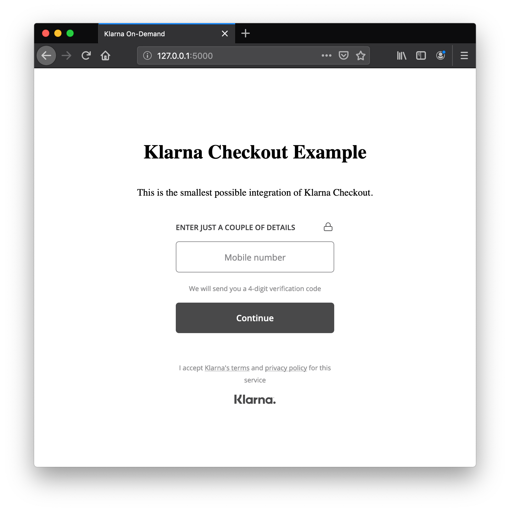

# on-demand-for-digital-goods-python

**Deprecation: This repository has been marked as deprecated.**


> An example for on demand for digital goods by [Klarna](https://www.klarna.com).

<details>
  <summary>Preview</summary>

  

</details>

## To run it:

```bash
virtualenv --no-site-packages venv
source venv/bin/activate
pip install -r requirements.txt
python run.py
```

## License

*on-demand-for-digital-goods-python* is realeased under the Apache 2.0 License.
